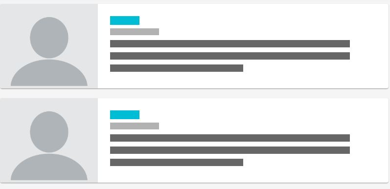
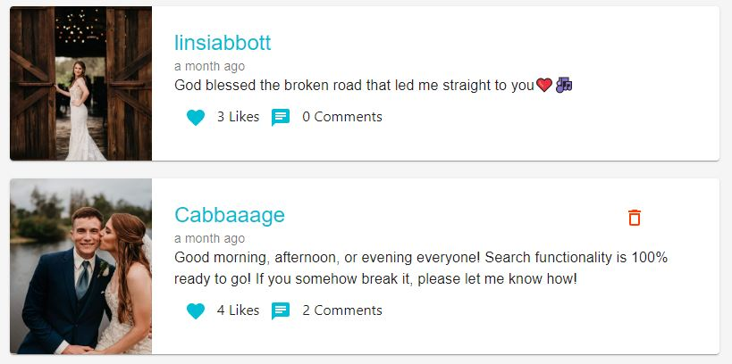
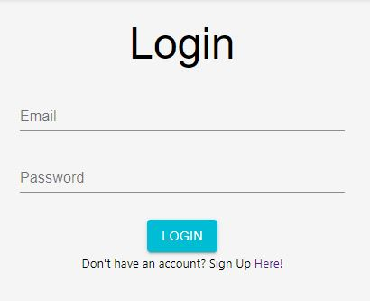
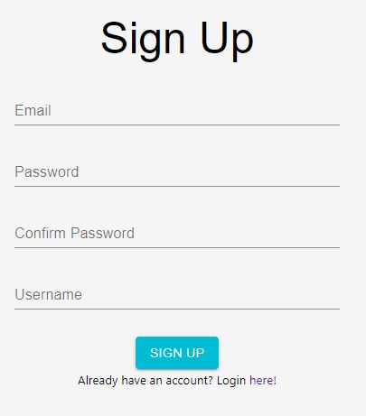
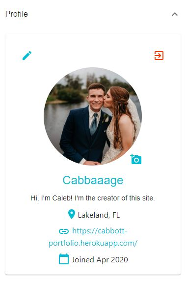
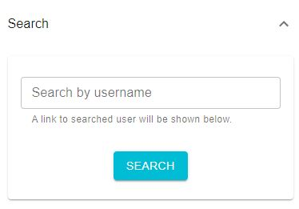
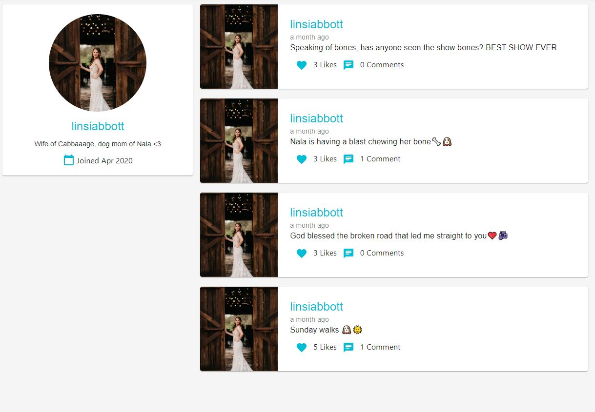
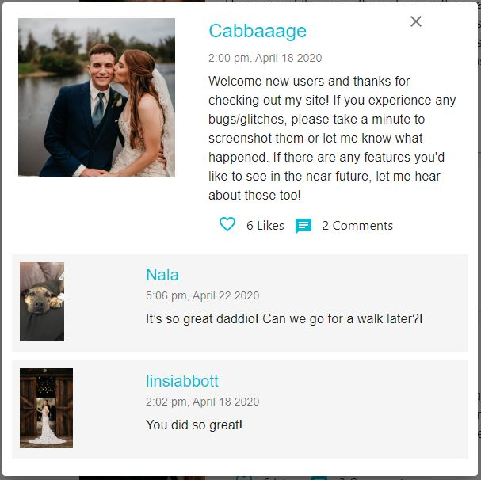
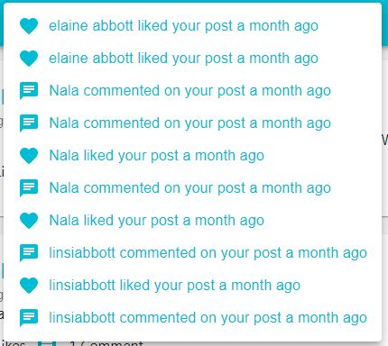
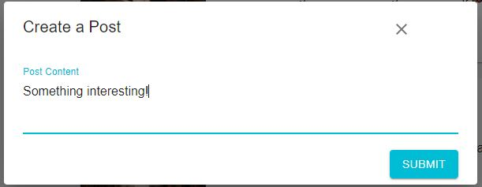

# The Patch

**The Patch** is an online social media platform that features unique user accounts.

With the site loading, you will be shown a **Loading Skeleton**

After the data has come through, the News Feed will be shown. Posts are listed in chronological order from most recent -> earliest.

Users will have access to the **News Feed** before logging in, but any actions taken other than viewing another user's account will direct them to the **Login** page:

# Login, Signup & Account

If the user needs to register, links to the **Sign Up** page will take them to:

After logging in, the user can view and edit their own details by selecting the dropdown option labelled **Profile**, found next to the **News Feed**

# Viewing another user's page

To view another user's page, simply select their username within the **News Feed**, or **Search** dropdown menu:

After selecting a user's name, the display will switch to show their personal details along with any of their posts:

# Likes and Comments

Users can also **Like and Comment** on a **Post**:

# Navbar

If a user recieves any **Likes and/or Comments**, they will be given a notification, accessible via the **Navbar**

In addition to housing the **Notifications** link, the **Navbar** also allows users to **Post** directly:

# Future Development

- User Messages
- Unique Background Images, chosen by the Account holder
